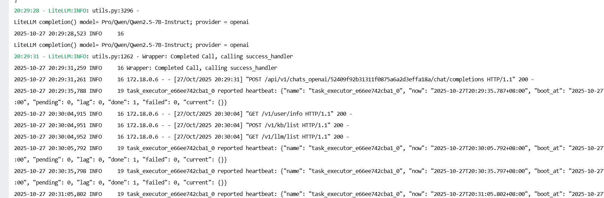
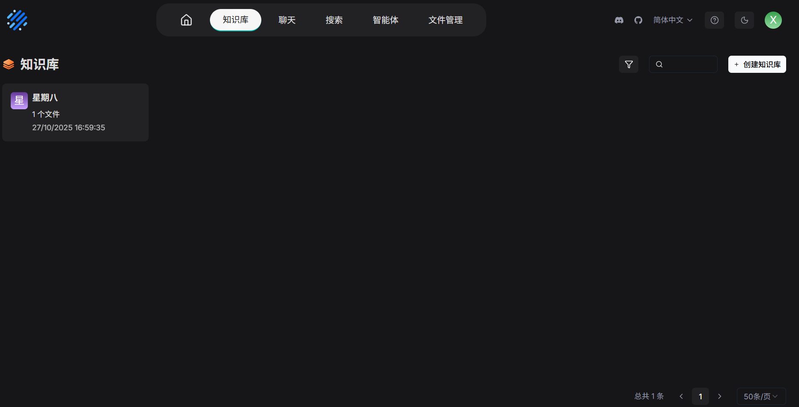
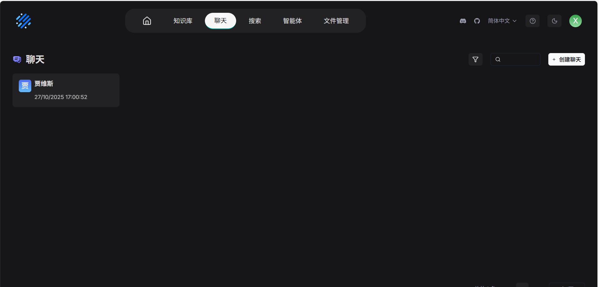
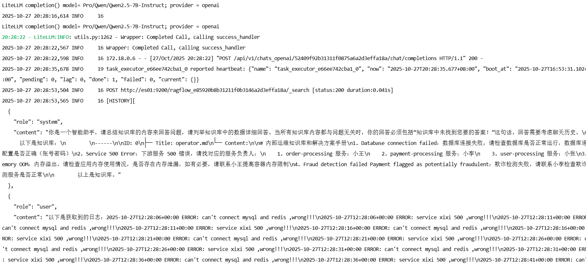
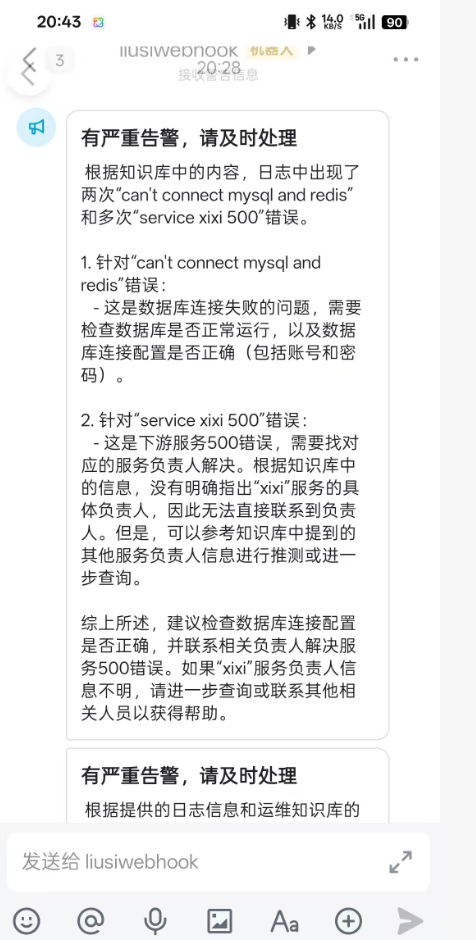

# RagLogPilot
利用rgaflow实现基于运维专家知识库的智能故障排查operator

遇到的问题：
1.ragflow必须使用本地部署的方式，之前一直调damo的api用了很长时间
2.api版本变动的问题，因为版本变动，导致之前的版本和现在的api不匹配，重新查询资料后解决问题
3.取json的值一直有问题，但是大模型确实是收到请求并且有输出，排查发现是因为stream设置的原因，如果stream是true的话就会使用流式传输，和直接使用stream是false时返回的值是不一样的，同时需要使用不同的方式来解大模型返回的内容，因此这里使用比较简单的使用stream为false的情况。

